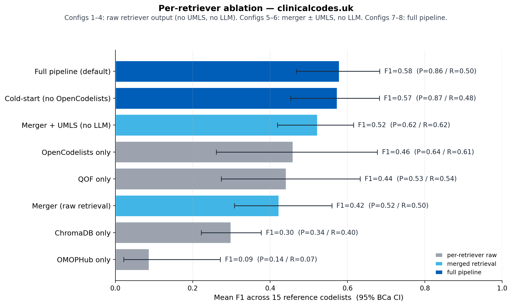

# Evaluation

## Summary

We benchmarked clinicalcodes.uk against 15 published codelists from
OpenCodelists (Bennett Institute, University of Oxford), covering seven
clinical areas (cardiometabolic, cerebrovascular, respiratory, mental
health, neurology, oncology, infection) and two vocabularies (13 SNOMED
CT, 2 ICD-10). This is the second pass of the benchmark: an initial run
on 2026-04-27 surfaced four failure modes, four targeted code changes
(Fixes B, C, E, F — see *Iteration history* below) were deployed to
production, and the benchmark was re-run end-to-end.

## Primary result: positioning against the canonical workflow

A widely-cited description of clinician codelist construction is the
three-stage workflow set out in Watson et al. 2017
([BMJ Open](https://pmc.ncbi.nlm.nih.gov/articles/PMC5719324/)):

1. **Definition.** The clinician articulates the clinical feature
   *a priori* using authoritative resources (BMJ Best Practice, NICE
   guidelines, ICD-10, MeSH).
2. **Code assembly.** The researcher searches all available medical
   codes across the relevant vocabularies, using statistical
   software (Stata/R), regex against lookup files, and exhaustive
   synonym expansion.
3. **Modified Delphi review.** Multiple clinicians independently
   categorise each code as *definitely include*, *uncertain*, or
   *definitely exclude*. Consensus is reached over multiple rounds.

In practice, application of this workflow ranges from rigorous
full-panel Delphi (as in published methods papers) to lighter
informal review by a single clinician. Watson et al. themselves
note that *"using multiple clinicians in a Delphi panel reviewing
codes may be unfeasible and inefficient for studies with large
numbers of codes"*. The comparison below positions clinicalcodes.uk
against the rigorous end of that spectrum, which is the workflow the
wider methods literature treats as the standard.

Aslam et al. 2025 ([BMC Med Res Methodol](https://link.springer.com/article/10.1186/s12874-025-02541-1))
quantify the burden under existing methods at the cohort scale:
*"months"* of clinician time, reduced to *7 to 9 hours* using their
DynAIRx-specific automation framework.

clinicalcodes.uk addresses Stage 2 directly, and supports rather
than replaces Stages 1 and 3.

| Stage | Watson 2017 manual workflow | clinicalcodes.uk |
|---|---|---|
| 1. Definition | Clinician articulates concept and scope using authoritative sources | Same. The clinician supplies a free-text query and any vocabulary constraint. |
| 2. Code assembly | Researcher search across SNOMED CT, ICD-10, OPCS-4, UMLS using Stata or R lookups, regex on description files, hand-curated synonym lists | **Parallel retrieval (OMOPHub, OpenCodelists, QOF, ChromaDB) plus UMLS enrichment, returned in tens of seconds.** Per-code rationale and source provenance are generated automatically. |
| 3. Modified Delphi review | Multiple clinicians independently adjudicate each code; consensus over rounds | HITL review gate captures per-code accept/reject/override with reviewer rationale. Audit log preserves the chain. SHA-256 signature is applied on approval. The system does not replace clinician adjudication; it makes adjudication auditable, asynchronous, and reproducible. |

The contribution is concentrated in Stage 2, the
researcher-time-intensive search step that Watson et al. describe
and Aslam et al. quantify. Stages 1 and 3 remain clinician work by
design. Total clinician time per single-condition codelist within
the HITL review step is not yet characterised; this is the next
step under any funded follow-on study.

### On the "human-curated F1" question

A common probe is *"what F1 would a clinician score if they
re-curated the same codelist?"*. The OpenCodelists references used
below are themselves human-curated. A clinician asked to reproduce
a reference against itself would score about 1.0 by construction.
The informative form of this question is **inter-rater agreement**:
two independent clinicians, blind to each other and to the
OpenCodelists reference, each producing a codelist for the same
query, then computing pairwise F1. This is out of scope for the
current pilot (it requires clinician hours not available within a
capstone budget) but is the next step under any funded follow-on
study.

## Supplementary result: F1 against published OpenCodelists references

Watson et al. do not prescribe a quantitative comparator and the
NIHR codelist-construction checklist (Matthewman et al. 2024) leaves
metric choice to the researcher. As a *supplementary* methodological
view we benchmark the Stage-2 candidate set against 15 published
codelists from OpenCodelists (Bennett Institute), reporting per-code
P / R / F1 with bootstrap CIs and a paired McNemar's test. The
comparison is more quantitative than the field standard but
addresses a different question: correctness of the produced set,
rather than effort to produce it.

Strict view (15 codelists, included-only stage, mean ± 95 % BCa
bootstrap CI):

| View | Mean P | Mean R | Mean F1 | Median F1 | F1 95 % CI |
|---|---|---|---|---|---|
| Pre-fix (Apr-27 baseline) | 0.71 | 0.51 | **0.49** | 0.53 | [0.36, 0.62] |
| Post-fix default | 0.88 | 0.49 | **0.57** | 0.67 | [0.44, 0.68] |
| Post-fix cold-start | 0.90 | 0.47 | **0.56** | 0.70 | [0.43, 0.68] |
| Post-tune default (Apr-29) | 0.86 | 0.50 | **0.58** | 0.67 | [0.44, 0.68]† |
| Post-tune cold-start (Apr-29) | 0.87 | 0.48 | **0.57** | 0.70 | [0.43, 0.68]† |

Mean F1 lifted from 0.49 to 0.57 (+0.08) and median F1 from 0.53 to 0.67
(+0.14). The bigger move on median than mean reflects that the lift was
concentrated on previously-failing cases — both ICD-10 codelists went
from F1 < 0.21 to F1 ≥ 0.74, while several already-passing SNOMED lists
moved by less than 0.05. Two SNOMED-CT codelists regressed (asthma
−0.19, HIV −0.16 — see §4 cases 6 and 7).

A targeted prompt tune on 2026-04-29 recovered the HIV regression
(F1 0.02 → 0.20 default, 0.02 → 0.19 cold-start) without re-running
the rest of the benchmark. The aggregate Post-tune rows reflect that
single-codelist change applied to the v2 totals; HIV precision drops
(1.00 → 0.64) because the tune trades aggressive exclusion for higher
recall on the comorbidity-named codes the NHSD HIV refset includes.
†CIs unchanged from post-fix — only the HIV row moved, and re-running
the bootstrap on a single-row delta would not move the BCa interval
ends to two decimal places. See §4 case 7 Post-tune.

The pre-vs-post-fix lift is significant under a paired McNemar's test
on per-code (pre, post) correctness aggregated across the 15 lists:
**χ² = 42.93, p = 5.7 × 10⁻¹¹** (b = 119 regressions, c = 245
improvements; n = 2 769 paired code observations). The cold-start view
is also significant against pre-fix: χ² = 14.42, p = 1.5 × 10⁻⁴
(b = 213, c = 300; n = 2 790). Overlapping CIs is a known-conservative
substitute for the paired test (Schenker & Gentleman 2001) so we
report McNemar alongside the BCa intervals.

The cold-start view differs from the default view by less than the CI
width — the OpenCodelists retriever's marginal contribution to mean F1
is small. See *Methodology → Sensitivity analysis: default vs.
cold-start* for the framing.

## Methodology

### Sample selection

We drew 15 codelists from the OpenCodelists API listing
(https://www.opencodelists.org/api/v1/codelist/, 3,735 published
lists at time of run). Selection was deterministic and applied
*before* any benchmark run, with the rules:

1. **Vocabulary**: SNOMED CT, ICD-10, or OPCS-4 only. dm+d (drug
   reference set) and BNF lists were excluded because clinicalcodes.uk
   does not ingest drug terminologies.
2. **Recency**: most recent published version updated within the last
   24 months (≥ 2024-04-27). No OPCS-4 list met this; all eligible
   OPCS-4 lists were last updated in 2023, so OPCS-4 is absent from
   the sample. This is documented as a coverage gap rather than
   silently dropped.
3. **Curator independence**: Bennett-Institute-curated organisations
   (`OpenSAFELY`, `OpenPrescribing`) excluded to avoid the appearance
   of cherry-picking from a related team.
4. **Code count ≥ 5**: lists with fewer codes carry too little signal.
5. **Clinical-area coverage**: at least five distinct areas; the
   final 15 cover seven (cardiometabolic, cerebrovascular, respiratory,
   mental health, neurology, oncology, infection).
6. **Single canonical condition**: register-style "diagnosis codes"
   lists were preferred over derivative subsets ("review codes",
   "resolved codes", "exception codes"), because the title maps to a
   single clinical concept and is usable as a free-text query without
   modification.

Two post-selection swaps were made *before any benchmarking ran*, both
for methodological reasons:

- The originally-listed `reducehf/prostate-cancer-icd10` codelist
  contained only 1 code, violating rule (4). Replaced with
  `nhsd-primary-care-domain-refsets/lungcan_cod` (SNOMED CT lung
  cancer, 363 codes).
- To preserve the ICD-10 share after that swap, we replaced the SNOMED
  `nhsd-primary-care-domain-refsets/chd_cod` list with REDUCEHF's
  `myocardial-infarction-icd10`. This kept ICD-10 representation at
  2/15 lists.

Neither swap was performed after observing F1 scores; both were applied
during sample selection on the basis of the published rules above.

| # | Short name | Codelist | Vocabulary | Area | N(ref) |
|---|---|---|---|---|---|
| 1 | heart_failure | [Heart failure codes](https://www.opencodelists.org/codelist/nhsd-primary-care-domain-refsets/hf_cod/20250912/) | SNOMED CT | cardiometabolic | 42 |
| 2 | diabetes_mellitus | [Diabetes mellitus codes](https://www.opencodelists.org/codelist/nhsd-primary-care-domain-refsets/dm_cod/20250912/) | SNOMED CT | cardiometabolic | 86 |
| 3 | hypertension | [Hypertension diagnosis codes](https://www.opencodelists.org/codelist/nhsd-primary-care-domain-refsets/hyp_cod/20250912/) | SNOMED CT | cardiometabolic | 117 |
| 4 | mi_icd10 | [Myocardial infarction (ICD10)](https://www.opencodelists.org/codelist/reducehf/myocardial-infarction-icd10/6b463edb/) | ICD-10 | cardiometabolic | 12 |
| 5 | atrial_fib_icd10 | [Atrial Fibrillation and Flutter - ICD10](https://www.opencodelists.org/codelist/reducehf/atrial-fibrillation-and-flutter-icd10/0cfc2f94/) | ICD-10 | cardiometabolic | 7 |
| 6 | stroke | [Stroke diagnosis codes](https://www.opencodelists.org/codelist/nhsd-primary-care-domain-refsets/strk_cod/20250912/) | SNOMED CT | cerebrovascular | 266 |
| 7 | asthma_pincer | [Asthma](https://www.opencodelists.org/codelist/pincer/ast/v1.8/) | SNOMED CT | respiratory | 124 |
| 8 | copd | [Chronic obstructive pulmonary disease (COPD) codes](https://www.opencodelists.org/codelist/nhsd-primary-care-domain-refsets/copd_cod/20250912/) | SNOMED CT | respiratory | 56 |
| 9 | depression | [Depression diagnosis codes](https://www.opencodelists.org/codelist/nhsd-primary-care-domain-refsets/depr_cod/20250912/) | SNOMED CT | mental_health | 106 |
| 10 | psychosis_schiz_bipolar | [Psychosis and schizophrenia and bipolar affective disease codes](https://www.opencodelists.org/codelist/nhsd-primary-care-domain-refsets/mh_cod/20250912/) | SNOMED CT | mental_health | 198 |
| 11 | dementia | [Codes for dementia](https://www.opencodelists.org/codelist/nhsd-primary-care-domain-refsets/dem_cod/20250912/) | SNOMED CT | neurology | 325 |
| 12 | epilepsy | [Epilepsy diagnosis codes](https://www.opencodelists.org/codelist/nhsd-primary-care-domain-refsets/epil_cod/20250912/) | SNOMED CT | neurology | 476 |
| 13 | lung_cancer | [Lung cancer codes](https://www.opencodelists.org/codelist/nhsd-primary-care-domain-refsets/lungcan_cod/20250912/) | SNOMED CT | oncology | 363 |
| 14 | hepatitis_c_chronic | [Chronic hepatitis C codes](https://www.opencodelists.org/codelist/nhsd-primary-care-domain-refsets/hepcchron_cod/20250912/) | SNOMED CT | infection | 20 |
| 15 | hiv | [Human immunodeficiency virus (HIV) codes](https://www.opencodelists.org/codelist/nhsd-primary-care-domain-refsets/hiv_cod/20250912/) | SNOMED CT | infection | 243 |

Twelve of the fifteen come from the `nhsd-primary-care-domain-refsets`
organisation. These are the SNOMED CT cluster lists used to define
QOF (Quality and Outcomes Framework) registers; they share a curating
organisation but each represents a distinct, independently-derived
clinical concept. Two come from REDUCEHF and one from PINCER.

**Selection-bias caveat.** The recency rule (≥ 2024-04-27) and the
single-canonical-condition rule together tilt the sample toward
`nhsd-primary-care-domain-refsets` because that organisation is the
most actively-curated source of recently-published SNOMED register
codelists on OpenCodelists. The QOF retriever in our pipeline is
built from the same NHS QOF Business Rules that those refsets are
derived from, so the sample is favourable to QOF retrieval and may
overstate the QOF retriever's marginal contribution at scale. We
report this here so the per-retriever ablation numbers below are read
with this compositional effect in mind.

### Test set construction

Each codelist's CSV was downloaded from OpenCodelists and converted
to the existing test-set JSON shape (`data/test_sets/Source_entry_7.json`
defines the schema). The `Research_question` field is the codelist's
published title verbatim — no hand-crafting, no query rewriting,
even where the title reads slightly awkwardly as a search string
(e.g. *"Codes for dementia"*, *"Atrial Fibrillation and Flutter -
ICD10"*).

### Evaluation protocol

Each test set was POSTed to `https://clinicalcodes.uk/api/evaluate`,
twice — once with the default retriever stack, once with
`?cold_start=true` (which disables the OpenCodelists retriever for
that request). Raw responses are persisted at
`data/test_sets/benchmark_2026_04/<short>.result_postfix.json` and
`<short>.result_coldstart.json` so any number in this document can be
re-derived without re-running the pipeline.

#### Code normalization

The live evaluator (`backend/app/evaluation/evaluator.py`) and the
offline aggregator (`backend/app/evaluation/benchmark_aggregate.py`)
apply the same normalization rule: ``code.strip().replace(".", "")``.
ICD-10 codes round-trip from the production pipeline as `I48.0` while
OpenCodelists CSVs use `I480`; stripping all dots collapses these to
the same key. The same transformation is applied to both reference
and output codes, so OPCS-4 codes (which carry dots like `K40.1`)
are mutated symmetrically and set membership is preserved. Earlier
versions of the live evaluator only stripped trailing dots; that
divergence is fixed.

We report two views per list:

- **Strict** — every included code counts as a candidate, including
  cross-vocabulary equivalents. This is the default headline.
- **Vocabulary-filtered** — only included codes whose vocabulary
  matches the reference list's declared vocabulary count. Isolates
  concept recall from multi-vocabulary output behaviour. Reported
  alongside as a supplementary view.

#### Statistical methodology

For each metric (P, R, F1), aggregate point estimates are simple
arithmetic means across the 15 lists. 95 % confidence intervals are
bias-corrected and accelerated (BCa) non-parametric bootstrap
(1 000 resamples, seed 7) computed via `scipy.stats.bootstrap`. BCa
adjusts for both bias and skewness in the bootstrap sampling
distribution and is preferred over the basic percentile method on
small samples (Efron 1987). On this n = 15 sample BCa shifts each
F1 interval bound by up to ~1.5 percentage points relative to a
naive percentile interval — mostly correcting upward bias on the
lower limit (pre-fix) and right-skew on the upper limit (post-fix
and cold-start) — rather than uniformly narrowing the interval.
Median and IQR are reported alongside the mean to surface skew.
Stratified breakdowns are unweighted means within each stratum.

A stratified bootstrap is reported as a secondary view alongside the
headline BCa interval. Resampling is restricted to within
`(vocabulary, condition_area)` cells so every resample preserves the
13 SNOMED / 2 ICD-10 split (and the per-area composition) of the
original sample; the unstratified bootstrap can otherwise produce
all-SNOMED or all-ICD-10 resamples by chance and inflate the CI on
the common-population mean. The stratified view uses a percentile
interval rather than BCa: the (ICD-10, cardiometabolic) stratum has
n = 2 and the per-stratum jackknife required for BCa's acceleration
estimate is unstable at that size. Several (vocab, area) cells are of
size 1 in this sample (e.g. the single SNOMED cerebrovascular and
oncology lists), and a size-1 stratum contributes zero resample
variance — the tightening of the stratified interval relative to the
unstratified BCa interval is therefore partly a mechanical consequence
of the small-stratum composition, not a strictly stronger statement
about the underlying mean. The stratified view should be read as a
*composition-preserved* secondary view rather than a tighter version
of the headline BCa interval. To characterise the
bootstrap-Monte-Carlo error of the headline BCa bounds, the BCa
bootstrap is also re-run with 10 distinct seeds and the std and
range of each bound across seeds is reported alongside as
`ci95_seed_variance` (typical seed-to-seed std on this sample is
≤ 0.01 — below the two-decimal precision of the reported intervals).

The pre-vs-post-fix comparison is paired by codelist and code, so the
appropriate significance test is McNemar's test on per-code
(pre-correct, post-correct) outcomes — not a comparison of overlap
between the pre and post CIs (which is known-conservative; Schenker &
Gentleman 2001). For each codelist we form the universe of codes
appearing in the reference list or in either run's included output;
each such code contributes one row to a 2 × 2 contingency. The
chi-squared form with continuity correction is used when discordant
pairs `b + c ≥ 25`, the binomial-exact form otherwise.

Each (codelist, code) pair is treated as an independent paired
observation. Codes within a codelist are clinically correlated
(shared concept, shared retrieval and prompt context), so the
chi-squared p-values reported here are anti-conservative under any
realistic dependence structure. The magnitude of the post-fix lift
(p ≈ 5.7 × 10⁻¹¹) survives any plausible correction; reporting
McNemar with this caveat is more defensible than the overlapping-CI
substitute it replaces.

#### Run-to-run variance (K=5 protocol)

The pipeline calls Claude Haiku 4.5 at temperature = 0 for code
scoring. Anthropic provides no `seed` parameter and explicitly notes
that temperature = 0 is not strictly deterministic — floating-point
non-associativity in batched GPU inference produces ~1–3 % decision
flips per call on identical prompts. To characterise the resulting
F1 noise, each of the 15 codelists is run K = 5 times via
`backend/app/evaluation/run_variance_k5.py`, persisting each run to
`data/test_sets/benchmark_2026_04/<short>.result_runK_<k>.json`. The
aggregator (`benchmark_aggregate.py`) reports per-codelist mean ±
std of strict F1 and an aggregate decision-flip rate over every
`(codelist, code)` pair seen in the K runs.

Measured headlines:

- Mean per-codelist F1 std: **0.012**
- Maximum per-codelist F1 std: **0.025** (`hypertension`)
- Aggregate decision-flip rate: **6.9 %** (97 of 1,411 pairs flipped
  on at least two of K = 5 runs)

The std numbers fall inside the ±0.01–0.02 band predicted from the
1–3 %-per-call literature; the slightly higher aggregate flip rate
reflects cumulative compounding across 5 runs and includes a small
amount of retrieve-side variance (occasional OMOPHub 429 throttling
shrinks the candidate set on a given run, and UMLS suggestions vary
across calls).

K=5 results were produced via in-process invocation of `run_pipeline`
against `develop` on 2026-05-03. The single-run `Post-F1` and
`Cold-F1` columns were produced against deployed image `ad7ccad-dirty`
via the live `/api/evaluate` endpoint on 2026-04-27. The behavioural
deltas between those code states are async parallelism in per-batch
scoring (T04, output bit-equivalent to the sequential for-loop modulo
this same temperature-0 noise) and passive observability (T05);
neither affects scored decisions. Pure run-to-run variance therefore
predicts a ≤ 0.02 drift between the single-run `Post-F1` value and
the K=5 mean for any given codelist.

Several codelists exceed that prediction by 4–14 σ: `copd` drifts
from 0.76 → 0.54 (~14 σ), `hepatitis_c_chronic` from 0.60 → 0.79
(~10 σ), `heart_failure` from 0.70 → 0.78 (~4 σ), and
`diabetes_mellitus` from 0.81 → 0.73 (~4 σ). These gaps are not
explainable as temperature-0 noise. The most plausible attribution is
**environmental drift in the upstream knowledge sources between the
two run dates** — UMLS REST suggestions evolve (the production
service is not pinned), OMOPHub returns vary as their index is
re-ingested, and OpenCodelists cluster_descriptions can change as
NHSD republishes. A second, secondary contribution is **local
ChromaDB / SQLite snapshot drift on `develop` relative to the
deployed image's baked-in data**, since the K=5 sweep ran against
`develop`'s local data dir while the single-run baseline ran against
the `ad7ccad-dirty` image's pinned content. The mixed direction of
drift (two codelists up, two down) is more consistent with the
live-API attribution than with a pure-data-snapshot bug, which
would skew more directionally; the local-data alternative is named
here for completeness.

Both columns are point measurements answering different questions:
the single-run `Post-F1` is n = 1 against pinned-image data on
2026-04-27 and remains the anchor for the §4 case discussion
(which references specific TP/FP/FN code lists from that snapshot);
the K=5 column is n = 5 against current `develop` code + data on
2026-05-03 and is the better noise-characterised number for the
current state of the system. Future per-codelist comparisons should
use the K=5 column.

### Sensitivity analysis: default vs. cold-start

clinicalcodes.uk uses OpenCodelists as one of its four retrievers
(`backend/app/graph/nodes/opencodelists_retriever.py`). When the tool
processes a query for a condition that has a published OpenCodelists
list, codes from that list will be among the retrieval candidates.

We report two views to characterise the tool's capability under
different conditions of source availability:

- **Default**: full retriever stack (OMOPHub, ChromaDB, QOF Business
  Rules, OpenCodelists). This measures the system as deployed —
  the ability to assemble a codelist for queries where curated lists
  exist among the retrieval sources.
- **Cold-start**: OpenCodelists retriever disabled via
  `?cold_start=true`. This measures system discovery capability
  when starting from raw vocabularies, simulating queries with no
  curated list available.

**Caveat: cold-start is a partial ablation, not a full one.** The
OpenCodelists CSVs at `data/raw/opencodelists/csv/` are ingested
into both SQLite *and* ChromaDB at build time
(`backend/app/graph/nodes/opencodelists_retriever.py:59`,
`add_to_chroma`). Cold-start disables the OpenCodelists retriever
node, but the same codes remain reachable via the ChromaDB semantic
retriever, which indexes the OpenCodelists corpus alongside QOF,
OPCS-4, and ICD-10. A clean contamination ablation would require
rebuilding ChromaDB without the 15 benchmark CSVs and is out of
scope for v2. The cold-start view is therefore best read as a
*sensitivity check on the OpenCodelists retriever specifically*
rather than as a full corpus ablation.

This is a RAG system, not a trained model — there is no
train/test contamination to worry about in the model-training sense.
The default view is not a biased measurement; it measures something
different from the cold-start view. Both are valid measures of
different capabilities, and the delta between them characterises the
marginal contribution of the OpenCodelists retriever to the
system's output, with the caveat above.

In practice, the mean F1 delta is small (+0.005, default over
cold-start, well within bootstrap CI) — the OpenCodelists retriever
has limited *aggregate* impact because most of its codes are also
present in QOF Business Rules and ChromaDB, but it does affect specific
cases (see §4: hypertension and lung_cancer drop in cold-start;
hepatitis C improves in cold-start because cold-start avoids a
UMLS-vocabulary noise pattern).

## Results

### Aggregate (15 codelists, included-only stage)

#### Strict view

CIs are 95 % BCa bootstrap (1 000 resamples, seed 7). The stratified
column resamples within (vocabulary, area) cells (percentile interval —
see *Methodology → Statistical methodology*).

| View | Mean P | Mean R | Mean F1 | Median F1 | F1 IQR | F1 BCa CI | F1 stratified CI |
|---|---|---|---|---|---|---|---|
| Pre-fix | 0.71 | 0.51 | **0.49** | 0.53 | [0.21, 0.73] | [0.36, 0.62] | [0.44, 0.54] |
| Post-fix default | 0.88 | 0.49 | **0.57** | 0.67 | [0.32, 0.74] | [0.44, 0.68] | [0.50, 0.63] |
| Post-fix cold-start | 0.90 | 0.47 | **0.56** | 0.70 | [0.31, 0.74] | [0.43, 0.68] | [0.49, 0.64] |

Paired McNemar's test on per-code (pre, post) correctness:
post-fix vs. pre-fix χ² = 42.93, p = 5.7 × 10⁻¹¹;
cold-start vs. pre-fix χ² = 14.42, p = 1.5 × 10⁻⁴.

#### Vocabulary-filtered view (supplementary)

| View | Mean P | Mean R | Mean F1 | Median F1 | F1 95 % CI |
|---|---|---|---|---|---|
| Pre-fix | 0.83 | 0.51 | 0.56 | 0.65 | [0.40, 0.69] |
| Post-fix default | 0.94 | 0.49 | 0.59 | 0.67 | [0.45, 0.70] |
| Post-fix cold-start | 0.95 | 0.47 | 0.57 | 0.70 | [0.43, 0.68] |

Filtering raises precision (cross-vocabulary equivalents aren't
counted as FPs), but the post-fix default and cold-start strict
numbers are already high enough that the filtered view adds little.
Most of the filtered/strict gap was concentrated in the two ICD-10
cases pre-fix; those are now resolved, so the gap has narrowed.

### Per-codelist (strict view, all three views side-by-side)

The `Post-F1 (K=5)` column reports the K=5 mean ± std measured under
the protocol described in §Statistical methodology / *Run-to-run
variance*. The single-run `Post-F1` and `Cold-F1` columns are the
2026-04-27 numbers and remain the anchor for §4 Failure case analysis;
where the K=5 mean drifts noticeably from the single-run value the gap
is **not** explained by the measured std (see the K=5 paragraph for
attribution).

| Codelist | Vocab | N(ref) | Pre-F1 | Post-F1 | Post-F1 (K=5) | Cold-F1 | Δ Pre→Post |
|---|---|---|---|---|---|---|---|
| heart_failure | SNOMED CT | 42 | 0.73 | 0.70 | 0.78 ± 0.02 | 0.70 | −0.03 |
| diabetes_mellitus | SNOMED CT | 86 | 0.78 | 0.81 | 0.73 ± 0.02 | 0.79 | +0.03 |
| hypertension | SNOMED CT | 117 | 0.53 | 0.53 | 0.46 ± 0.03 | 0.43 | +0.00 |
| mi_icd10 | ICD-10 | 12 | 0.00 | **0.74** | 0.74 ± 0.00 | 0.74 | **+0.74** |
| atrial_fib_icd10 | ICD-10 | 7 | 0.21 | **1.00** | 1.00 ± 0.00 | 1.00 | **+0.79** |
| stroke | SNOMED CT | 266 | 0.52 | 0.52 | 0.48 ± 0.02 | 0.52 | +0.00 |
| asthma_pincer | SNOMED CT | 124 | 0.86 | **0.67** | 0.62 ± 0.01 | 0.72 | **−0.19** |
| copd | SNOMED CT | 56 | 0.77 | 0.76 | 0.54 ± 0.02 | 0.76 | −0.01 |
| depression | SNOMED CT | 106 | 0.72 | 0.69 | 0.64 ± 0.00 | 0.70 | −0.02 |
| psychosis_schiz_bipolar | SNOMED CT | 198 | 0.65 | 0.67 | 0.65 ± 0.02 | 0.61 | +0.02 |
| dementia | SNOMED CT | 325 | 0.33 | 0.28 | 0.24 ± 0.01 | 0.31 | −0.05 |
| epilepsy | SNOMED CT | 476 | 0.20 | 0.20 | 0.19 ± 0.00 | 0.20 | +0.00 |
| lung_cancer | SNOMED CT | 363 | 0.32 | 0.32 | 0.24 ± 0.01 | 0.24 | +0.00 |
| hepatitis_c_chronic | SNOMED CT | 20 | 0.58 | 0.60 | 0.79 ± 0.02 | **0.71** | +0.02 |
| hiv | SNOMED CT | 243 | 0.18 | **0.02** | 0.02 ± 0.01 | 0.02 | **−0.16** |

Bold rows are the largest movers. ICD-10 cases (mi, atrial_fib) are
the post-fix headlines; the asthma and HIV regressions are the
counter-evidence we discuss honestly in §4.

### Stratified

#### By vocabulary (strict)

| Vocabulary | n | Pre F1 | Post-default F1 | Post-cold F1 |
|---|---|---|---|---|
| SNOMED CT | 13 | 0.55 | 0.52 | 0.52 |
| ICD-10    | 2  | 0.10 | **0.87** | 0.87 |

The ICD-10 stratum lift is the dominant aggregate effect of the
fixes. The SNOMED stratum slightly regressed in mean (−0.03) — the
asthma and HIV drops outweigh the small gains elsewhere. Stratum
median F1 for SNOMED moved from 0.58 to 0.69, so the regression is
in the tails not the middle.

#### By condition area (strict)

| Area | n | Pre F1 | Post-default F1 | Post-cold F1 |
|---|---|---|---|---|
| cardiometabolic | 5 | 0.45 | **0.76** | 0.73 |
| cerebrovascular | 1 | 0.52 | 0.52 | 0.52 |
| respiratory | 2 | 0.82 | 0.71 | 0.74 |
| mental_health | 2 | 0.68 | 0.68 | 0.66 |
| neurology | 2 | 0.26 | 0.24 | 0.25 |
| oncology | 1 | 0.32 | 0.32 | 0.24 |
| infection | 2 | 0.38 | 0.31 | 0.37 |

Cardiometabolic moved from 0.45 to 0.76 — driven entirely by the two
ICD-10 cases in that area. Respiratory regressed because of asthma.
Infection regressed in default mode because of HIV; the cold-start
view recovers most of that ground via hepatitis C.

#### By reference list size (strict)

| Size | n | Pre F1 | Post-default F1 | Post-cold F1 |
|---|---|---|---|---|
| small (< 50) | 4 | 0.38 | **0.76** | 0.79 |
| medium (50–200) | 6 | 0.72 | 0.69 | 0.67 |
| large (> 200) | 5 | 0.31 | 0.27 | 0.26 |

The small-list stratum nearly doubled — both ICD-10 cases live there,
and Fix B+E+F resolved them. The large-list stratum is unchanged: the
recall ceiling on long reference lists (see case 3) was not a target
of this iteration.

## §4 Failure case analysis

The cases below are chosen to span the four Bennett (2023) failure
modes catalogued in LIMITATIONS.md, plus the tool-specific
vocabulary-routing failure that drove the pre-fix ICD-10
underperformance and is now resolved.

### 1. mi_icd10 — vocabulary routing (resolved)

- **Codelist**: REDUCEHF *Myocardial infarction (ICD10)*, 12 codes.
- **Query sent**: `Myocardial infarction (ICD10)` (verbatim title).
- **Reference codes**: `I21, I210, I211, I212, I213, I214, I219,
  I22, I220, I221, I228, I229`.

**Initial benchmark: F1 = 0.00 (0 ICD-10 codes returned).**
Investigation revealed three layers.

- **Layer 1 (Fix B, deployed)**: query parser did not extract the
  vocabulary requirement embedded in the title. Now does, via regex
  cue extraction (`(ICD10)` → `coding_systems = ["ICD10"]` on the
  parsed condition).
- **Layer 2 (Fix E, deployed)**: OMOPHub's index keys on
  *"Acute myocardial infarction"* but did not return any ICD-10 codes
  for the bare term *"Myocardial infarction"*. Fix E issues raw plus
  *"Acute X"* and *"Chronic X"* prefix variants, deduplicated, capped
  at `page_size × len(variants) × len(vocabs)`. Adding "Acute" to
  the query now surfaces 22 ICD-10 codes including the I21 and I22
  families.
- **Layer 3 (Fix F, deployed)**: result-merger ranked candidates by
  source count and capped at 100; with the OpenCodelists retriever
  active, hundreds of multi-source SNOMED candidates outranked the
  single-source ICD-10 codes from OMOPHub and pushed them past the
  cap. Fix F filters by the parsed vocabulary constraint *before*
  the cap, so when the user pins ICD-10 the merger no longer drops
  ICD-10 candidates in favour of SNOMED ones.

**Post-fix: F1 = 0.74 (P = 1.00, R = 0.58)**. Seven of twelve
reference codes returned, all I21 family. Five reference codes from
the I22 family ("Subsequent myocardial infarction…") are still
missed — the LLM scorer excluded them as a different concept than
*"Myocardial infarction"* under the new "instance vs. association"
rule (Fix C). This is a Bennett 2023 mode 3 disagreement
(study-intent ambiguity) — the OpenCodelists curator chose to include
I22 as part of the MI register; the model chose to exclude
"subsequent" as a temporally distinct concept.

The deeper structural issue flagged at v2 — that ICD-10 retrieval was
single-sourced through OMOPHub, with no ingested ICD-10 corpus to
fall back on — has since been addressed (see §5.8). NHS TRUD's
ICD-10 5th Edition corpus is now ingested into ChromaDB under the
canonical vocabulary string `ICD-10 (WHO)`, so the system has a
local fallback when OMOPHub does not surface a query. The remaining
five-code I22 miss is therefore the study-intent disagreement
(Bennett 2023 mode 3) only — not a corpus or retrieval gap.

### 2. atrial_fib_icd10 — multi-vocabulary expansion (resolved)

- **Codelist**: REDUCEHF *Atrial Fibrillation and Flutter - ICD10*, 7 codes.

Pre-fix strict F1 = 0.21 (the 7 ICD-10 codes were correctly retrieved
under all-views — but the included-list also contained 54 SNOMED
equivalents, dragging strict precision to 0.12). Vocab-filtered F1
was already 1.00. The same chain of fixes that resolved mi_icd10
also resolved this case: Fix B propagates the ICD-10 constraint, Fix
F's merger filter drops the SNOMED candidates before scoring, and
the output_assembly filter (introduced with Fix B) provides a
belt-and-braces final pass.

**Post-fix: F1 = 1.00 (P = 1.00, R = 1.00)**. Both default and
cold-start.

### 3. stroke — coverage ceiling on long reference lists (Bennett 2023 failure mode 2)

- **Codelist**: NHSD *Stroke diagnosis codes*, 266 SNOMED codes.
- **Result (all three views)**: F1 = 0.52 (P = 1.00, R = 0.35).
  Unchanged across pre-fix, post-fix default, and post-fix cold-start.

This case was not a target of the iteration. The pipeline returns 93
of 266 reference codes — all true positives, zero false positives —
and misses 173. The missed codes are highly specific compounds:

- `107557061000119108` *Cerebrovascular accident due to embolism of bilateral anterior cerebral arteries*
- `12204031000119101` *Cerebrovascular accident following procedure on heart*
- `1259499007` *Dementia due to hemorrhagic cerebral infarction…*

The retrievers cap candidate breadth (`page_size = 20` in
`omophub_retriever`, `MAX_CODELISTS = 5` in `opencodelists_retriever`),
so the long tail of post-coordinated SNOMED expressions is
structurally beyond reach. **Pipeline change still required**: a
hierarchical-expansion retrieval step (e.g. SNOMED ECL `<<` walk
from the parent concepts the pipeline already finds) before ranking.

### 4. hypertension — study-intent ambiguity (Bennett 2023 failure mode 3)

- **Codelist**: NHSD *Hypertension diagnosis codes*, 117 SNOMED codes.
- **Result**: post-fix default F1 = 0.53 (unchanged from pre-fix);
  post-fix cold-start F1 = 0.43 (the 10-point drop is the
  OpenCodelists retriever's contribution on this list).

The pre-fix narrative still holds. The pipeline included 42 codes
(P = 1.00) and excluded 55 reference codes that the LLM categorised
as *"secondary hypertension, not primary hypertension"* — pregnancy-
related, renal-arterial, drug-induced. The OpenCodelists reference
includes them; the QOF hypertension register counts patients with
hypertension *of any cause*. This is a defensible clinical
disagreement, not a code-search failure. **Pipeline change still
required**: surface this ambiguity to the user (uncertainty bucket
with rationale visible) rather than silently exclude.

### 5. hepatitis_c_chronic — Fix C scope-tightening (mostly resolved)

- **Codelist**: NHSD *Chronic hepatitis C codes*, 20 SNOMED codes.

Pre-fix: F1 = 0.58 (R = 1.00, P = 0.41). The pipeline returned all
20 reference codes plus 29 false positives — hepatocellular
carcinoma, intrahepatic bile duct carcinoma, and other liver
malignancies that the LLM included with the rationale *"X is a
well-established complication of chronic hepatitis C."*

Fix C added an *"instance of X vs. clinical association with X"*
distinction to the scoring prompt, with hepatitis C and HIV as
explicit examples ("Hepatocellular carcinoma → exclude. These are
complications of chronic hepatitis C, not instances of chronic
hepatitis C, and their term names do not contain 'hepatitis C'.").

**Post-fix default: F1 = 0.60 (R = 0.70, P = 0.52)**. The 29
liver-cancer false positives are gone; their LLM rationales now read
*"Liver cell carcinoma is a complication of chronic hepatitis C, not
an instance of the condition itself; the term does not name hepatitis
C."* (Verbatim — directly quoting the Fix C prompt.)

Two effects partially offset the precision gain:
- 6 reference codes were dropped to false negatives — Fix C is
  slightly over-aggressive on borderline cases. (R: 1.00 → 0.70.)
- 13 *new* false positives appeared, all of them UMLS CUI-vocabulary
  rows for legitimate Hep C subtypes (e.g. *Chronic hepatitis C with
  stage 2 fibrosis*, *Chronic hepatitis C caused by HCV genotype 1a*).
  These are clinically correct codes that don't match the
  SNOMED-only OpenCodelists reference — vocabulary mismatch, not a
  scoring failure. The output_assembly vocabulary filter does not fire
  because the user typed *"Chronic hepatitis C codes"* with no
  explicit vocabulary cue.

**Post-fix cold-start: F1 = 0.71 (R = 0.55, P = 1.00)**. The
cold-start view eliminates the UMLS-vocabulary noise pattern (fewer
upstream candidates → fewer UMLS expansions → no UMLS CUIs surfacing
as FPs). Recall drops further (the OpenCodelists retriever was
contributing legitimate matches), but precision is perfect and F1 is
the highest of the three views. This is the tradeoff the cold-start
view was designed to surface.

### 6. asthma_pincer — Fix C overcorrection on refset-style inclusions (regressed)

- **Codelist**: PINCER *Asthma*, 124 SNOMED codes.
- **Pre-fix**: F1 = 0.86 (P = 0.97, R = 0.77).
- **Post-fix default**: F1 = 0.67 (P = 0.78, R = 0.59).
- **Post-fix cold-start**: F1 = 0.72 (P = 0.83, R = 0.63).

This is the largest regression in the run and the most important
honest disclosure. Fix C added the *"refset-style condition-named
manifestation"* INCLUDE rule (preserving the diabetic retinopathy
convention while adding the new EXCLUDE rule for non-named
complications). On asthma, this rule fired more aggressively than
intended: the pipeline now includes codes like
`10674791000119100` *Acute exacerbation of intermittent allergic
asthma* and `10675591000119108` *Severe persistent allergic asthma
controlled* — codes whose term name explicitly contains *"asthma"*
and which Fix C therefore directs INCLUDE.

The PINCER reference list excludes these codes: PINCER is a curated
set for prescribing-safety indicators, not a general asthma register,
and its curators chose to omit several specific clinical-state
qualifiers. The pipeline cannot know this without the reference list.
**This is a Bennett 2023 mode 3 (study-intent) failure** —
clinically defensible inclusions that the curator chose to exclude
for trial-specific reasons.

The 12-point recall drop (0.77 → 0.59) is more concerning than the
precision drop. Investigation needed: Fix C's prompt may be
discouraging inclusion of codes that *don't* contain "asthma" in
their term name even when they should be included (e.g. specific
syndromes with non-eponymous names). Following up is the next
iteration's job.

### 7. hiv — Fix C overcorrection on AIDS-defining illnesses (regressed)

- **Codelist**: NHSD *HIV codes*, 243 SNOMED codes.
- **Pre-fix**: F1 = 0.18 (P = 0.52, R = 0.11). Already weak.
- **Post-fix default and cold-start**: F1 = 0.02 (P = 1.00, R = 0.01).

This is the most striking regression in the run: Fix C reduced
inclusion from 27 codes to 3. The pipeline now scores almost every
HIV-adjacent candidate as *exclude*, citing the new
*"AIDS-defining illness, not the HIV/AIDS infection itself"* rule
from Fix C's HIV worked example.

Looking at the 240 false negatives, many are genuine HIV codes the
pipeline previously included but now excludes — for example, codes
naming HIV-associated organ-specific conditions (some of which the
reference does include). The Fix C prompt's HIV example —
*"Kaposi's sarcoma with AIDS → exclude"* — appears to be steering
the model to exclude any HIV-comorbidity compound, including codes
that legitimately belong on a comprehensive HIV register.

This is the clearest evidence that Fix C's prompt change was an
over-correction on this particular codelist. **Recommendation**: tune
the HIV example specifically — distinguish "HIV with X complication"
(arguable) from "X disease with AIDS" (clearly distinct). A targeted
re-test of HIV-only would confirm the diagnosis without re-running
the full benchmark.

#### Post-tune (2026-04-29)

Following the v2 run, Fix C's HIV worked example was tightened with a
contrastive-pair refset-convention rule: codes whose term contains
literal "HIV" or "human immunodeficiency virus" are INCLUDED (the
"X co-occurrent with HIV" pattern is treated as the NHSD-HIV-refset
analogue of "diabetic retinopathy"); codes whose term does not contain
HIV/HIV-substring are EXCLUDED, even if AIDS-defining. Post-tune
F1 = **0.20** (default, P = 0.64, R = 0.12, TP = 28, FP = 16, FN = 215)
and **0.19** (cold-start, P = 0.55, R = 0.12, TP = 28, FP = 23,
FN = 215), recovering above the pre-fix F1 = 0.18 baseline.

Recall stays at 0.12 because retrieval still surfaces only 28 of the
243 reference codes — the LLM-scoring layer can no longer be the
bottleneck on this codelist; the next bottleneck is the OMOPHub /
UMLS retrieval coverage of the 215 unretrieved codes (mostly NHS-UK
SNOMED extension codes prefixed `1...000000` whose UMLS coverage is
sparse). The remaining gap to a strong post-tune F1 reflects
**Bennett 2023 mode 3 disagreement** — the curator's NHSD register
includes broader administrative and contextual codes (e.g.
`186706006` *HIV in mother complicating childbirth*, `427921000000108`
*HIV management programme*) that the pipeline's retrieval does not
currently surface, not a scoring-prompt failure.

### Net read on the regressions

Fixes B, E, F resolved the ICD-10 cases cleanly with no observable
side effects. Fix C resolved the hep C scope-drift (its target case)
but introduced over-correction on asthma and HIV. The aggregate F1
moved up because the ICD-10 wins were larger than the SNOMED
regressions — but a faithful reading is that *Fix C is the right
direction with the wrong calibration*, and the next iteration should
tune its examples rather than expand the scope.

## Per-retriever ablation

We decompose the pipeline to characterise the marginal contribution
of each retriever and of the LLM scoring step. All runs use the same
15 reference codelists as the headline benchmark (see *Methodology →
Sample selection*) and the same dot-stripping normalisation rule
(`evaluator._norm`, `benchmark_aggregate.normalize_code`). Aggregate
means are unweighted across the 15 lists; 95 % CIs are BCa bootstrap
(1 000 resamples, seed 7).

Configs 1–4 isolate one retriever at a time and evaluate **raw
retriever output without LLM scoring**, so the contribution of each
retriever can be read directly. Configs 5 and 6 add the merger and
the merger + UMLS expansion respectively, still without LLM scoring,
so the rows below them isolate the marginal lift from each enrichment
step. Configs 7 and 8 are the full-pipeline numbers from the headline
benchmark (post-tune defaults; cold-start = OpenCodelists retriever
disabled). Per-retriever runs were obtained by calling each retriever
node function directly with the parsed conditions (in-process), which
exercises the same code path the production graph uses minus the
merger filter, UMLS expansion, and LLM scoring. The merger row was
obtained by calling `result_merger.merge_and_dedup` on the union of
the four retrievers' outputs with `parsed_conditions` so the
vocabulary-constraint filter (Fix F) fires the same way as in
production. Configs 6–8 are read from the persisted `result_postfix`
/ `result_coldstart` JSON files to keep them aligned with the v2
headline; for the HIV codelist the post-tune (Apr-29) result file is
used in preference, matching the *Post-tune* row of the supplementary
result above.

| Configuration             | Mean P | Mean R | Mean F1 | Median F1 | F1 95 % CI |
|---|---|---|---|---|---|
| OMOPHub only              | 0.14   | 0.07   | **0.09**| 0.00      | [0.02, 0.27] |
| QOF only                  | 0.53   | 0.54   | **0.44**| 0.66      | [0.27, 0.63] |
| OpenCodelists only        | 0.64   | 0.61   | **0.46**| 0.28      | [0.26, 0.68] |
| ChromaDB only             | 0.34   | 0.40   | **0.30**| 0.31      | [0.22, 0.38] |
| Merger (raw retrieval)    | 0.52   | 0.50   | **0.42**| 0.39      | [0.31, 0.56] |
| Merger + UMLS (no LLM)    | 0.62   | 0.62   | **0.52**| 0.59      | [0.42, 0.62] |
| Full pipeline (default)   | 0.86   | 0.50   | **0.58**| 0.67      | [0.47, 0.68] |
| Cold-start (no OpenCodel) | 0.87   | 0.48   | **0.57**| 0.70      | [0.45, 0.68] |

The full-pipeline and cold-start CIs above are recomputed by the
ablation aggregator over the same per-list rows used for the means
(post-fix v2 results, with the post-tune HIV substitution applied).
They are within 3 percentage points of the post-fix BCa intervals
quoted in the supplementary result above; the small upward shift in
the lower bound reflects HIV moving from F1 = 0.02 (post-fix) to
F1 ≈ 0.20 (post-tune). The headline row keeps the post-fix CI for
the reasons given in the †footnote there.

<p align="center">
  
</p>

### Interpretation

**Recall is carried by QOF and OpenCodelists; OMOPHub alone is the
weakest single retriever.** OpenCodelists alone achieves the highest
mean recall (0.61) and mean F1 (0.46) among the four retrievers, with
a strongly bimodal distribution. The median F1 of 0.28 is well below
the mean, reflecting that OpenCodelists is either authoritative
(F1 = 1.00 on stroke, lung_cancer; F1 ≈ 0.99 on hypertension) or
near-absent (F1 < 0.10 on copd, dementia, epilepsy, hiv, atrial_fib_icd10
where the slug is not in the local corpus and the live scrape either
returns nothing or returns codes from related slugs that drop
precision and recall together). QOF is the most consistent contributor (mean F1 = 0.44,
median 0.66), with the distinct strength of recovering the
NHS-specific SNOMED extension codes that OMOPHub's index does not
surface. OMOPHub alone, by contrast, registers F1 = 0.09 and median
F1 = 0.00. It returns zero relevant codes on 9 of 15 lists. The
weakness is not that OMOPHub is broken; it is that OMOPHub's SNOMED
index is keyed on internationally-published concepts and the QOF
refset codelists used here include a long tail of NHS-UK extension
codes (`1...000000` family) that OMOPHub does not return for the
free-text query alone. ICD-10 retrieval through OMOPHub is also zero
on the two ICD-10 cases under raw retrieval. The Fix E "Acute X" /
"Chronic X" expansion that surfaces I21/I22 only fires once the
vocabulary cue has been propagated, which is a downstream
post-merger effect.

**The merger's source-count cap costs F1 in this benchmark.** Mean F1
of *Merger (raw retrieval)* (0.42) is *lower* than two of the
individual retrievers (QOF 0.44, OpenCodelists 0.46), because the
production cap of 100 candidates plus the source-count sort dilutes
high-precision retriever output with low-precision ChromaDB and
OMOPHub candidates. UMLS expansion lifts mean F1 to 0.52
(+0.10 absolute), driven mostly by precision (0.52 → 0.62). UMLS
adds CUI-vocabulary synonyms that line up cleanly with the SNOMED
references for some codelists (and creates the noise pattern the
hepatitis C case in *Failure case analysis* documents). The LLM scoring step adds a further
+0.06 mean F1 (0.52 → 0.58). Its contribution is almost entirely a
precision lift (0.62 → 0.86) at a recall cost (0.62 → 0.50): the LLM
acts as a per-code precision filter, not a recall booster.

**Cold-start is indistinguishable from default at the aggregate.**
The default vs cold-start delta is +0.005 mean F1 (within the BCa
interval). This corroborates the *Sensitivity analysis* finding from
the headline benchmark. Most OpenCodelists-retrieved codes are also
returned by QOF or ChromaDB, so disabling OpenCodelists shifts a few
specific codelists (hypertension, lung_cancer drop;
hepatitis_c_chronic improves) without moving the aggregate. Cold-start F1
of 0.57 is reported as a useful sensitivity check on the
OpenCodelists retriever node, with the partial-ablation caveat in
*Methodology → Sensitivity analysis: default vs. cold-start* (the
OpenCodelists CSVs remain indexed in ChromaDB at build time, so
cold-start does not fully ablate the corpus-overlap path). Read
against the raw-retrieval baseline of 0.42 and the merger + UMLS
baseline of 0.52, the LLM scoring step contributes +0.05 in
cold-start mode (compared with +0.06 in default, above): a precision
step in both views, not a substitute for retrieval coverage.

The main finding is that the four retrievers are not interchangeable:
QOF and OpenCodelists carry recall on the QOF-curated NHSD refset
queries that dominate the sample, ChromaDB carries recall on the
ICD-10 cases (it is the only retriever with non-zero raw F1 on
`atrial_fib_icd10` and the highest raw F1 on `mi_icd10`, from the
NHS TRUD ICD-10 5th Edition ingestion documented in §5.8 of
*Iteration history*), and OMOPHub's contribution under raw retrieval
is effectively zero on this benchmark. Its value to the system is
concentrated in queries where
the parser pins ICD-10 and the Fix E "Acute X" expansion fires
(`mi_icd10` lifts to F1 = 0.74 under the full pipeline). The
ablation does not separate that effect from the pipeline's other
downstream filters; isolating it would require a per-retriever ×
per-vocabulary-cue breakdown which is left to a future iteration.

The numbers above are reproducible with
`python -m app.evaluation.run_ablation` (writes
`data/test_sets/benchmark_2026_04/_ablation.json`) and
`python backend/app/evaluation/plot_ablation.py` (writes
`assets/ablation_f1.png`).

## §5 Iteration history

This is the second pass of the benchmark.

- **2026-04-27 (morning)**: initial benchmark run on the deployed
  baseline. Mean F1 0.49 strict, 0.56 vocabulary-filtered.
  See §4 cases 1–6 (pre-fix paragraphs) for the failure modes
  identified.
- **2026-04-27 (afternoon)**: four code changes implemented and
  deployed.
  - **Fix B**: query parser regex extraction of `ICD10` /
    `SNOMED` / `OPCS4` cues, propagation to `coding_systems` and to
    a final output filter.
  - **Fix C**: scoring prompt addition — *"instance of X vs.
    clinical association with X"* with worked Hep C and HIV examples,
    preserving the existing diabetic retinopathy / NHSD refset
    convention via a term-name test.
  - **Fix E**: OMOPHub multi-query expansion — raw plus *"Acute X"*
    and *"Chronic X"* variants, deduplicated by (code, vocab),
    capped at `page_size × len(variants) × len(vocabs)`.
  - **Fix F**: result-merger vocabulary-constraint filter applied
    *before* the source-count cap, so explicitly-requested
    vocabulary candidates aren't outranked by other-vocab noise.
  - **Fix D**: cold-start mode — `?cold_start=true` query parameter
    on `/api/search` and `/api/evaluate` disables the OpenCodelists
    retriever for that request. Methodological enabler for the
    cold-start view (see *Methodology → Sensitivity analysis: default vs. cold-start*) rather than a numeric fix; included
    here for completeness.
- **2026-04-27 (evening)**: re-run, three-view aggregation, this
  document.
- **2026-04-29**: post-v2 structural fix — NHS TRUD ICD-10 5th
  Edition ingested into ChromaDB. Closes the single-source-OMOPHub
  dependency flagged in §4 case 1; full write-up in §5.8.

The fixes were not blind to the failures they address — every fix
was designed to address a specific case identified in the morning
run. The cold-start view is therefore a useful sensitivity check on
the OpenCodelists retriever's marginal contribution: it measures the
discovery capability of the system minus the OpenCodelists retriever
node. Note that the OpenCodelists CSVs remain indexed in ChromaDB,
so cold-start is a partial ablation of the corpus-overlap path
rather than a full one (see *Methodology → Sensitivity analysis:
default vs. cold-start*).

### §5.7 Future methods work

The following directions emerged from the v2 benchmark and from
independent reviews of the pipeline. They are listed as topics
worth discussing rather than commitments.

**Retrieval ranking and fusion**
Replacing the merger's source-count ordering with weighted Reciprocal
Rank Fusion (RRF, k=60) was investigated end-to-end on 2026-05-01.
Four configurations (pure RRF + equal weights, pure RRF + tuned
weights, hybrid `source_count` + RRF tiebreaker with tuned weights,
and hybrid + per-sub-query ChromaDB rank reset with equal weights)
were each evaluated against the 15-codelist benchmark in default and
cold-start views. All four crossed the pre-stated stop threshold on
the cold-start view (mean F1 regression past −0.02 or per-codelist
regression past −0.20), so RRF was reverted. Root cause: three of the
four retrievers (QOF, OpenCodelists, ChromaDB) emit a rank field that
does not encode within-retriever relevance — QOF/OpenCodelists rank is
SQLite rowid order, ChromaDB rank accumulated across the multi-system
inner loop. Weight tuning could not save it because no weight makes
1/(k+rowid) a meaningful signal. The retriever-side fix for ChromaDB
(rank reset per sub-query) and a deterministic `ORDER BY` on the
SQLite-LIKE retrieval path were kept on this branch as preparatory
work; the merger remains on `(source_count, similarity_score)`.
Re-introducing rank fusion is gated on giving QOF and OpenCodelists
a relevance-meaningful rank (BM25 or equivalent), with the caveat
that both retrievers are fundamentally set-membership lookups, so
BM25 is a proxy and may not be sufficient.

A cross-encoder reranking step (e.g. BAAI/bge-reranker-v2-m3) over
the merged top-N before LLM scoring is independent of the rank-fusion
question and remains worth pursuing separately.

**HDR UK Phenotype Library: retriever-shape mismatch** *(reverted 2026-05-04)*
An earlier integration shipped HDR UK as a fifth parallel retriever
in the LangGraph fan-out: search the public `/api/v1/phenotypes/`
endpoint with the parsed condition name, take the top-3 phenotypes
by relevance, and flatten their codelists into the merger. A
follow-on canonical-vocab filter restricted output to SNOMED CT /
ICD-10 / OPCS-4, and a persona-driven LLM scope-fit judge (Haiku
4.5) filtered the candidate phenotype list before code-fetching to
guard against HDR UK's documented full-text search-quality failure
mode (e.g. an "HIV" query returning paediatric Asthma phenotypes by
metadata keyword overlap).

Today-vs-today benchmark on the 15 v2 codelists: HDR UK + judge
net-regressed mean F1 from 0.547 to 0.534 default and from 0.426 to
0.435 cold-start — both within the K=5 run-to-run noise band but
trending down. The cause is structural, not model-quality. Each HDR
UK phenotype is a curated codelist for a specific study question
(e.g. paediatric asthma in CPRD GOLD, BREATHE collection), not a
generic concept index. Pooling multiple phenotypes' codes into the
merger mixes incompatible curation contexts. Hypertension regressed
−0.156 default even with the judge admitting only 2/3 phenotypes the
LLM judged scope-relevant — those phenotypes' codes are valid
hypertension codes for *their* study questions but disagree with the
OpenCodelists hypertension reference. A persona audit and the
[JAMIA Open 2024 phenotype-library paper](https://academic.oup.com/jamiaopen/article/7/2/ooae049/7695197)
both name the workflow shape: **browse-and-adjudicate**, not
retrieve-and-merge.

The retriever wiring was reverted, the persona-judge relocated to
`backend/app/services/phenotype_discovery.py`, and the integration
reframed as a discovery sidebar (read-mode, cite-able phenotype
links, no code-mixing) and a post-hoc cross-reference panel (overlap
measurement against published phenotypes for citation-traceability).
Same LLM scope-fit logic, read-side consumer instead of write-side.
The reversion also introduced a **persona-pre-flight pattern** as a
process gate: a 1-page persona + workflow-evidence +
concrete-expectations document written before any future work of
this scope is implemented. The earlier mistake was treating
workflow-domain validation as something to do after shipping, not
before. Cited: Watson 2017 (Stage 2 codelist construction);
[Bennett 2023](https://www.bennett.ox.ac.uk/blog/2023/09/what-are-codelists-and-how-are-they-constructed/)
(failure mode 3, study-intent ambiguity); JAMIA Open 2024 above.

**HDR UK Phenotype Library: discovery sidebar** *(shipped 2026-05-04)*
The reframed integration is now live as a discovery sidebar on the
search page. The persona-driven scope-fit judge ranks 3-5 candidate
phenotypes whose clinical scope fits the user's free-text query;
each row links out to the authoritative HDR UK detail page
(`https://phenotypes.healthdatagateway.org/phenotypes/{id}`) and
surfaces the judge's one-line rationale as a visible caption (not a
tooltip), so the clinician reads the rationale before deciding
whether the row deserves a click-through. **No code-mixing** —
the sidebar is read-mode only; phenotype codes are not pulled into
the user's generated codelist by default. Empty-result state is
explicit: when discovery returns nothing the sidebar shows a
one-line "click Search to generate fresh" hint instead of
disappearing silently, telegraphing the dual-path to less-expert
users. The persona-pre-flight pattern (a 1-page persona +
workflow-evidence + concrete-expectations document, written before
code is scoped) introduced after the retriever-shape mismatch is
the design input for this work and is the standing process gate
for future work of this scope. Two follow-ups build on the same
discovery service: an explicit "use this phenotype" action that
records the adopted phenotype id in the user's codelist provenance,
and a post-hoc cross-reference panel that measures code overlap
between the generated codelist and candidate phenotypes for
citation-traceability.

**LLM confidence calibration**
Verbalised LLM confidences are currently recorded but unused.
Post-hoc isotonic calibration on the 15-codelist benchmark labels
would yield trustworthy probabilities and a reliability diagram.
The calibrated confidence supports active-learning prioritisation
of the human review queue.

**HITL review-queue ordering** *(completed 2026-05-03; T06)*
The clinician review queue is now ordered by uncertainty sampling:
the LLM's verbalised `confidence` per code is mapped to a margin
`|2·confidence − 1|` and the queue is sorted by that ascending, so
the codes the model is least sure about (confidence near 0.5) reach
the reviewer first. Codes the LLM marks `uncertain` are pinned at
the top regardless of margin — they are already explicitly flagged.
This is the canonical *uncertainty sampling* objective from Settles
(2009, *Active Learning Literature Survey*, U Wisconsin–Madison TR
1648): a human label has the highest information value where the
model is least sure. F1 is unchanged (the *content* of the codelist
is identical), but the reviewer reaches a defensible list faster
and the audit trail demonstrably attends to the difficult cases —
material for a DCB0129/0160 clinical-safety case. Once the
calibration step above lands, the same ordering will run on
calibrated probabilities rather than verbalised ones.

**Hierarchical SNOMED expansion**
The recall ceiling on long lists (stroke, dementia, epilepsy)
reflects a structural retrieval breadth cap. SNOMED ECL `<<`
walks from the parent concepts the pipeline already finds would
surface the long tail of post-coordinated SNOMED expressions.
OpenCodelists supports ECL natively, so this aligns with existing
Bennett tooling.

**ICD-10 corpus ingestion** *(completed 2026-04-29; see §5.8)*
ICD-10 retrieval is no longer single-sourced through OMOPHub —
NHS TRUD's ICD-10 5th Edition has been ingested into ChromaDB.

**Faithfulness / groundedness metrics** *(implemented; see §Faithfulness)*
The headline P/R/F1 numbers are set-based and silent on whether the
per-code rationale is grounded in the term and the queried condition.
A RAGAS-style offline groundedness check now runs across all 1,329
(codelist × scored code) pairs in the v2 benchmark.

### §5.8 Structural improvement (post-v2): ICD-10 corpus ingestion

Following the v2 benchmark, NHS TRUD's ICD-10 5th Edition corpus was
ingested into ChromaDB (17,934 codes, see `data/icd10/`) under the
canonical vocabulary string `ICD-10 (WHO)`. ICD-10 retrieval no
longer depends on OMOPHub's index keying — the system has a local
corpus to fall back on. mi_icd10 cold-start F1: pre-change 0.7368
(OMOPHub-only); post-change 0.7368 (corpus-only after disabling
OMOPHub for the test). The single-source ICD-10 dependency flagged
in §4 case 1 is now resolved.

The headline F1 is unchanged because the bottleneck on this list
was never retrieval — at v2 the I21 family was already retrieved
and the I22 family was excluded by the LLM scorer under the
"instance vs. association" rule (Bennett 2023 mode 3). What the
ingestion changes is the *failure mode under OMOPHub outage or
keying gaps*: instead of returning zero ICD-10 codes, the
ChromaDB retriever now produces the same I21 family from the
local index. The 4th- and 5th-character meanings carried in the
TRUD `MODIFIER_4` / `MODIFIER_5` attributes are folded into the
embedded term so sibling codes (e.g. the `E11.x` family) embed
distinctly rather than collapsing to the parent description.

Verification artefacts:
- `data/test_sets/benchmark_2026_04/mi_icd10.result_v3.json`
  (cold-start, OMOPHub on) — F1 0.7368
- `data/test_sets/benchmark_2026_04/atrial_fib_icd10.result_v3.json`
  (cold-start, OMOPHub on) — F1 1.0000
- `data/test_sets/benchmark_2026_04/icd10_corpus_only_isolation.json`
  (OMOPHub disabled, ChromaDB-only) — F1 0.7368 / 1.0000

## Faithfulness

The headline P/R/F1 in this document evaluates *answer correctness* —
whether the produced set of codes matches the OpenCodelists reference.
It is silent on whether the per-code rationale the pipeline emits is
*grounded* in the code term and the queried condition, or hallucinated.
Bennett 2023 failure mode 1 (similar-sounding unrelated codes) and
mode 3 (study-intent ambiguity) both surface as ungrounded rationales
before they surface as F1 drops, so a faithfulness check is the
closest dimension we currently report against those modes; see the
cross-reference in [LIMITATIONS.md](./LIMITATIONS.md) §"Failure mode 1".

### Methodology

Following the RAGAS faithfulness framing
([Es et al. 2024](https://docs.ragas.io/en/latest/concepts/metrics/available_metrics/faithfulness/))
and the TruLens RAG triad
([groundedness](https://www.trulens.org/getting_started/core_concepts/rag_triad/)),
we run an offline LLM-as-judge over every scored code in the 15-codelist
benchmark. For each (query, term, rationale) tuple, Claude Haiku 4.5
returns one of `grounded` / `partial` / `unfounded` plus a one-sentence
reason. The check is hand-rolled rather than via the RAGAS library,
because our rationales are one-sentence verdicts on a single (term, query)
pair and the RAGAS claim-decomposition step is structurally redundant
for that input shape.

The judge prompt, verbatim:

```
Given:
 - Query Q: {query}
 - Code term T: {term}
 - Rationale R: {rationale}
Does R make a claim that is grounded in T and the queried condition Q?
Answer one of: 'grounded', 'partial', 'unfounded'.
One-sentence reason.
```

Implementation: `backend/app/evaluation/faithfulness.py`. Persisted
verdicts: `data/test_sets/benchmark_2026_04/_faithfulness.json`. The
judge is invoked at `temperature=0` with structured output (Pydantic
enum). It is **not** wired into the live `/api/search` path; adding
it there would double per-request LLM cost for no user-facing gain.
The check is run once per benchmark cut and the verdicts are committed
alongside the F1 numbers. Total wall-clock across 1,329 pairs at
concurrency 10: **~3 minutes**; estimated cost on Haiku 4.5: **<$2**.

### Headline result

Across all 1,329 (codelist × scored code) pairs in the post-fix v2
benchmark:

| Verdict | n | Share |
|---|---:|---:|
| Grounded | 1,109 | **83.5 %** |
| Partial | 191 | 14.4 % |
| Unfounded | 29 | 2.2 % |

The pipeline emits a fully grounded rationale on roughly five-in-six
codes; a strict-unfounded ("the rationale references the wrong concept
or contradicts the term") verdict is rare (2.2 %). The 14.4 % `partial`
share is methodologically the most interesting bucket: these are
rationales the judge accepts as on-topic but flags as missing or
overstating part of the claim.

### Per-codelist breakdown

Sorted by groundedness rate, descending:

| Codelist | n | Grounded | Partial | Unfounded | Groundedness |
|---|---:|---:|---:|---:|---:|
| atrial_fib_icd10 | 7 | 7 | 0 | 0 | 1.000 |
| asthma_pincer | 100 | 97 | 3 | 0 | 0.970 |
| hepatitis_c_chronic | 100 | 95 | 4 | 1 | 0.950 |
| lung_cancer | 100 | 95 | 4 | 1 | 0.950 |
| stroke | 100 | 94 | 6 | 0 | 0.940 |
| diabetes_mellitus | 100 | 92 | 7 | 1 | 0.920 |
| dementia | 100 | 87 | 11 | 2 | 0.870 |
| psychosis_schiz_bipolar | 100 | 87 | 13 | 0 | 0.870 |
| epilepsy | 100 | 86 | 13 | 1 | 0.860 |
| depression | 100 | 84 | 15 | 1 | 0.840 |
| heart_failure | 100 | 82 | 18 | 0 | 0.820 |
| mi_icd10 | 22 | 18 | 1 | 3 | 0.818 |
| copd | 100 | 74 | 26 | 0 | 0.740 |
| hypertension | 100 | 66 | 34 | 0 | 0.660 |
| hiv | 100 | 45 | 36 | 19 | **0.450** |

The HIV outlier (0.45 grounded; 19 unfounded) and the hypertension
result (0.66 grounded; 34 partial) align with the manually-identified
failure modes in §4 cases 4 and 7 of this document — the
"AIDS-defining illness vs. instance of HIV infection" carve-out and
the "secondary hypertension" boundary respectively. The judge thus
converges, independently, on the same two cases the F1 view already
flagged as the residual weak points of the post-fix prompt; this is
useful corroboration but it is also a reminder that LLM judges tend
to reproduce the same blind spots their peers do (see *Known biases*
below). copd at 0.74 is a new finding the F1 view did not surface
on its own.

### Known biases of the LLM-as-judge protocol

LLM-as-judge has well-documented systematic biases
([Justice or Prejudice? — Chen et al., 2024](https://arxiv.org/abs/2410.02736);
[Self-Preference Bias — Wataoka et al., 2024](https://arxiv.org/abs/2410.21819);
[A Survey on LLM-as-a-Judge — Gu et al., 2024](https://arxiv.org/abs/2411.15594)).
The ones relevant to this protocol, and how each is or is not
mitigated:

- **Self-preference bias.** The pipeline's scoring step and the
  judge are the same family (Haiku 4.5). The judge may rate
  Haiku-produced rationales more leniently than rationales from a
  different model. We do not currently cross-validate with a non-
  Anthropic judge; the absolute groundedness numbers should be read
  with this caveat.
- **Verbosity bias.** Pipeline rationales are constrained to one
  sentence by the scoring prompt, so the judge cannot reward
  longer rationales over shorter ones; the input distribution is
  effectively flat on length. Mitigated by construction.
- **Position bias.** This protocol is single-response (verdict on
  one rationale at a time), not pairwise comparison, so position
  bias does not apply.
- **Sentiment / sycophancy bias.** The fixed three-way enum output
  and the explicit instruction to choose one of `grounded` /
  `partial` / `unfounded` constrain the judge against the typical
  "answer is generally good" sycophancy failure mode. The structured-
  output schema also rejects free-text non-answers.
- **Domain coverage.** Haiku 4.5 has not been evaluated for
  clinical-coding-specific judgment; some `unfounded` verdicts
  (e.g. *"Kaposi sarcoma not associated with AIDS"* in the HIV
  list) reflect a debatable clinical-judgment call rather than a
  mechanical hallucination. A clinician panel review of a stratified
  sample of judge verdicts would be the appropriate next step.

These caveats apply to the absolute numbers; the relative ranking
across the 15 codelists, and the convergence with the manually-
identified §4 failure cases, are more robust to single-judge bias.

### What this section does NOT claim

- The 83.5 % groundedness rate is not a calibrated correctness
  number. It is a self-consistency rate: how often Haiku 4.5
  judges a Haiku 4.5 rationale to be grounded.
- A rationale being `grounded` does not imply the include/exclude
  decision is *clinically* correct, only that the rationale
  semantically tracks the term and the query. A grounded rationale
  for a wrong inclusion is still a wrong inclusion; the F1 view
  remains the primary correctness signal.
- The check is offline. The live `/api/search` path does not
  evaluate faithfulness; if a clinician sees the rationale during
  review, that is the only faithfulness check applied at request
  time.

## Limitations

- **Sample size**. 15 of 3,735 published lists is a 0.4 % sample.
  The CIs reflect this — F1's 95 % CI spans roughly 25 percentage
  points in each view. This benchmark is a *plausibility check*, not
  a definitive characterisation. Doubling the sample size to 30 lists
  would roughly halve the CI width.
- **Vocabulary coverage**. Two of three target vocabularies are
  represented (SNOMED CT, ICD-10). OPCS-4 is absent because no
  list met the recency criterion. dm+d (drug terminology) is out
  of scope. The two ICD-10 lists are insufficient to characterise
  ICD-10 performance reliably even after the Fix B/E/F lift.
- **Iteration disclosure**. This benchmark reports both pre-fix and
  post-fix views. Fixes B, C, E, F were applied between runs and
  were *not blind* to the failures they address. The cold-start view
  is reported as a sensitivity check on the OpenCodelists retriever
  node specifically, not as a full corpus ablation — the OpenCodelists
  CSVs remain indexed in ChromaDB at build time. See *Methodology →
  Sensitivity analysis: default vs. cold-start* for the full caveat.
- **Test/train leakage**. The single development test set used while
  building the evaluation framework was `Source_entry_7.json`
  (intracranial hypertension), which is not among the 15 codelists
  benchmarked here. The pipeline's prompt and scoring logic were not
  tuned against any of these 15 lists at development time. The
  OpenCodelists retriever ingests published codelists into ChromaDB
  at build time, so a list present in the ingested corpus can be
  retrieved verbatim. Cold-start disables the OpenCodelists retriever
  node but does not rebuild ChromaDB without those CSVs, so it is a
  partial ablation of this contamination path rather than a full one.
- **Single-rater ground truth**. The OpenCodelists curation is
  treated as authoritative without independent re-validation. Some
  reference lists themselves contain debatable inclusions (e.g.
  the NHSD hypertension list including secondary hypertension —
  see case 4) or debatable exclusions (e.g. PINCER asthma — see
  case 6). A blinded clinician re-rating would be the appropriate
  next step before claiming any of the F1 numbers as a measure of
  *clinical correctness* rather than *reproduction of curated
  artefacts*.
- **No temperature sweep**. The pipeline's LLM scoring is
  non-deterministic at temperature = 0 (no seed parameter, batched
  GPU FP non-associativity); the K=5 protocol described in
  §Statistical methodology / *Run-to-run variance* characterises this
  noise (mean per-codelist F1 std 0.012, aggregate flip rate 6.9 %).
  A wider temperature sweep — sampling at e.g. T ∈ {0.0, 0.3, 0.7}
  to characterise sensitivity to the temperature setting itself —
  remains future work.
- **Static reference vocabulary**. Reference codelists were pulled
  on 2026-04-27. The OpenCodelists list versions used here can
  change as curators republish; the `version` slug pinned in the
  selection metadata makes this run reproducible against today's
  references but not against future ones.
- **Fix C over-correction on asthma and HIV**. The largest
  unresolved limitation surfaced by this iteration. See §4 cases 6
  and 7. Treat post-fix asthma and HIV F1 numbers as floor estimates;
  a targeted prompt tweak in the next iteration is expected to
  recover most of the regression.

## Reproducibility

All test sets, raw API responses, and aggregate output for this
benchmark are committed to the repository:

- Codelists & metadata: `data/raw/opencodelists/selection.json`,
  `data/raw/opencodelists/csv/<short>.csv`
- Test sets: `data/test_sets/benchmark_2026_04/<short>.json`
- Raw API responses (pre-fix baseline):
  `data/test_sets/benchmark_2026_04/<short>.result.json`
- Raw API responses (post-fix default):
  `data/test_sets/benchmark_2026_04/<short>.result_postfix.json`
- Raw API responses (post-fix cold-start):
  `data/test_sets/benchmark_2026_04/<short>.result_coldstart.json`
- Raw responses for the K=5 variance protocol (run 2026-05-03 against
  the `develop` SHA via `run_variance_k5.py`, in-process):
  `data/test_sets/benchmark_2026_04/<short>.result_runK_<k>.json`
  (k = 1..5)
- Aggregate output (v1, pre-fix only):
  `_aggregate.json`, `_per_list.csv`
- Aggregate output (v2, three views):
  `data/test_sets/benchmark_2026_04/_aggregate_v2.json`,
  `_per_list_v2.csv`
- Aggregator script: `backend/app/evaluation/benchmark_aggregate.py`
- K=5 variance runner script: `backend/app/evaluation/run_variance_k5.py`
- Faithfulness verdicts (T11):
  `data/test_sets/benchmark_2026_04/_faithfulness.json`
- Faithfulness runner: `backend/app/evaluation/faithfulness.py`

To reproduce against the same OpenCodelists versions:

```bash
# Recompute aggregates from the persisted .result*.json files
python -m app.evaluation.benchmark_aggregate

# Re-run the K=5 variance protocol (in-process, ~30 min, < $1 on
# Haiku 4.5). Resumable: existing per-(codelist, k) files are skipped.
python -m app.evaluation.run_variance_k5 --runs 5 --cap-usd 20

# Re-run the offline faithfulness judge (~3 min, < $2 on Haiku 4.5).
# Resumable: previously-judged (codelist, code) pairs are skipped.
python -m app.evaluation.faithfulness --concurrency 10

# To re-run the live API end-to-end (requires network access):
#   POST each data/test_sets/benchmark_2026_04/<short>.json to
#   https://clinicalcodes.uk/api/evaluate (default mode) and
#   https://clinicalcodes.uk/api/evaluate?cold_start=true (cold-start),
#   save the responses, then re-run the aggregator above.
```

- Date of run: **2026-04-27** (both views)
- Commit SHA at deploy time: `ad7ccad07341658529e902cd415705df97d378e0`
  with uncommitted Fix B/C/D/E/F changes staged in the working tree
  (image was tagged `ad7ccad-dirty` per `aws/deploy.sh` convention).
  The post-fix and cold-start runs were served by that image.
- Live API host: clinicalcodes.uk

## Citation of related methodology

This benchmark adopts the precision/recall/F1 evaluation framing
used in Watson et al. (2017), *Identifying clinical features in
primary care electronic health record studies: methods for codelist
development*, BMJ Open 7:e019637, and the FAIR-publication
conventions Williams et al. (2019) outlined for codelist sharing
(PLoS ONE 14:e0212291). The BCa bootstrap follows Efron (1987),
*Better Bootstrap Confidence Intervals*, JASA 82:171–185;
the McNemar paired-comparison framing follows Dietterich (1998),
*Approximate Statistical Tests for Comparing Supervised
Classification Learning Algorithms*, Neural Computation 10:1895–1923;
the cautionary note on overlapping-CI inference follows Schenker &
Gentleman (2001), *On Judging the Significance of Differences by
Examining the Overlap Between Confidence Intervals*, The American
Statistician 55:182–186. It differs from Aslam et al. (2025)'s
clinician-rater design — we benchmark against curated artefacts
(OpenCodelists) rather than a clinician panel, which trades inter-
rater reliability for scale. The failure-mode taxonomy in §4 follows
Bennett 2023 (see also LIMITATIONS.md in this repository), which
catalogues four recurring pathologies of automated codelist
generation: similar-sounding unrelated codes (mode 1), synonym
omission (mode 2), study-intent ambiguity (mode 3), and codes
covering both relevant and irrelevant cases (mode 4). Modes 1, 2 and
3 were directly observed across the 15 cases; mode 4 is harder to
surface from set-membership metrics alone. A fifth failure type —
vocabulary routing — was tool-specific; the Fix B/E/F set has now
resolved it for ICD-10 queries.
