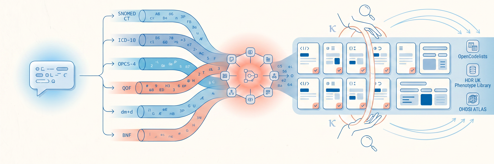
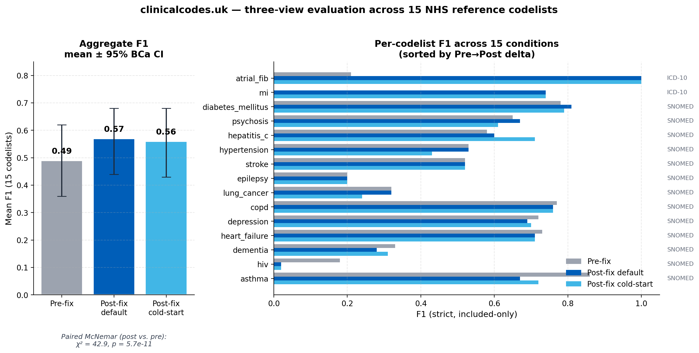

<p align="center">
  
</p>

<p align="center">
  
  &nbsp;&nbsp;&nbsp;&nbsp;&nbsp;
  
</p>

# Clinical Code Discovery - Multi-source clinical codelist generation with LLM-assisted scoring and human review

<p align="center">
  <a href="https://github.com/carlos-ramblox/nice-clinical-codes/actions/workflows/ci.yml"></a>
  <a href="LICENSE"></a>
  
  
  
  <a href="https://github.com/carlos-ramblox/nice-clinical-codes/commits/main"></a>
</p>

> **Try it without installing anything at [clinicalcodes.uk](https://clinicalcodes.uk).** No account required for a single demo query; clinician sign-in is needed for the human-review workflow.

Multi-source pipeline that **discovers** candidate clinical codes (SNOMED CT, ICD-10, OPCS-4) via four parallel retrievers across UK clinical vocabularies, **enriches** them through UMLS-based synonym expansion, and supports **validation** through per-code LLM scoring (Claude Haiku 4.5) and a human review gate. Developed as part of the University of Cambridge (PACE) Data Science programme, in collaboration with NICE stakeholders.

Given a clinical condition (e.g. "type 2 diabetes with hypertension"), the pipeline returns a candidate codelist with full provenance — every code carries its source(s), an LLM-generated rationale, and a confidence score. Human reviewers then accept, reject or edit individual codes before the codelist is exported. The output format is compatible with OpenCodelists. End-to-end latency for a representative single-condition query is on the order of tens of seconds, dominated by per-code LLM scoring and subject to model availability and source-API response time; we have not yet characterised median or worst-case latency on a fixed test set (see [LIMITATIONS.md](LIMITATIONS.md)). The published comparator for manual codelist construction is months of clinician time, reduced to 7-9 hours under Aslam et al. 2025's automation framework on the DynAIRx multi-long-term-conditions cohort.

## Architecture

```
User → Frontend (Next.js)
         │
         ▼  /api/*
       Backend (FastAPI)
         │
         ▼
       LangGraph Pipeline
         │
         ├─→ Query Parser (Claude API)
         │
         ├─→ Retrievers (parallel)
         │     ├── OMOPHub (SNOMED/ICD-10, live API)
         │     ├── QOF Business Rules (SQLite)
         │     ├── OpenCodelists (SQLite)
         │     └── ChromaDB (semantic search over SQLite corpus)
         │
         ├─→ Result Merger + Dedup
         ├─→ UMLS Enrichment (synonyms, narrower, siblings - live API)
         ├─→ LLM Reasoning (Claude API)
         ├─→ Human Review Gate (writes audit_log → SQLite)
         └─→ Output Assembly
```

## Tech Stack

- **Pipeline orchestration:** LangGraph (multi-agent StateGraph with parallel fan-out)
- **LLM-assisted scoring:** per-code rationale generated by Claude Haiku 4.5; query parsing by Claude Sonnet 4
- **Human review:** every codelist passes through a review gate where clinicians accept, reject or edit individual codes before export (OpenCodelists-compatible format)
- **Backend:** Python, FastAPI, async pipeline execution
- **Frontend:** Next.js 16, TypeScript, Tailwind CSS
- **Vector DB:** ChromaDB with PubMedBERT biomedical embeddings
- **Relational store:** SQLite — ingested code corpus (`backend/app/db/code_store.py`, ~53K rows across QOF, OPCS-4, ICD-10, OpenCodelists) and HITL workflow tables (`hitl_store.py`: codelists, decisions, audit log with deterministic SHA-256 content-hash that detects post-approval edits)
- **Knowledge graph:** UMLS Metathesaurus (synonym, narrower, sibling expansion)
- **Data sources:** QOF Business Rules, OpenCodelists, OPCS-4, NHS TRUD ICD-10 5th Edition, OMOPHub, UMLS (53K+ codes ingested locally)
- **Deployment:** AWS ECS Fargate, ECR, ALB, ACM, Route 53. Live at [clinicalcodes.uk](https://clinicalcodes.uk)
- **Cost:** per-query cost dominated by the LLM scoring step; tracked at request time but not currently benchmarked against a fixed test set

## Evaluation

Benchmarked against the three-stage codelist construction workflow set out in [Watson et al. 2017 (BMJ Open)](https://pmc.ncbi.nlm.nih.gov/articles/PMC5719324/), one of the standard methodology references in this field. clinicalcodes.uk **addresses Stage 2** (multi-vocabulary code assembly across SNOMED CT, ICD-10, OPCS-4 and UMLS, returned in tens of seconds). It supports rather than replaces Stage 1 (clinician definition) and Stage 3 (Delphi-style adjudication), via free-text query input and an audited human-review gate. As a supplementary methodological view, strict-view F1 against 15 published OpenCodelists references is 0.49 → 0.57 (+0.08); paired McNemar χ² = 42.93, p = 5.7×10⁻¹¹. Per-retriever ablation (marginal contribution of each retriever and of the LLM scoring step) is reported in [EVALUATION.md §Per-retriever ablation](EVALUATION.md#per-retriever-ablation). Full methodology, per-codelist breakdown, and failure-case analysis in [EVALUATION.md](EVALUATION.md).

<p align="center">
  
</p>

<sub>Numbers are from the v2 (post-fix) benchmark on 2026-04-27. The HIV regression visible at F1 = 0.02 was subsequently tuned to F1 = 0.20 on 2026-04-29 — see [EVALUATION.md](EVALUATION.md) §4 case 7. For the clinical-safety mapping (DCB0129 / DCB0160) see [CLINICAL_SAFETY.md](CLINICAL_SAFETY.md).</sub>

## Reproducibility

The pipeline aims for the same query at time T to yield the same candidate codelist, to the extent the underlying sources and model providers allow. Bit-identical reproduction across calendar time is not claimed.

**Deterministic by construction:**

- **Both LLM stages run at `temperature=0`:** query parsing with Claude Sonnet 4 (`backend/app/graph/nodes/query_parser.py`) and per-code scoring with Claude Haiku 4.5 (`backend/app/graph/nodes/llm_reasoning.py`). Candidates are sorted by `(vocabulary, code)` before batching (`llm_reasoning.py:158`), so identical input yields identical prompt batches across runs.
- **Model identifiers are pinned** to date-stamped IDs in `backend/app/config.py`: `claude-sonnet-4-20250514` for query parsing and `claude-haiku-4-5-20251001` for per-code scoring. Floating aliases such as "latest" are not used.
- **File-based sources are versioned snapshots:** QOF Business Rules (`Business_Rules_Combined_Change_Log_QOF+2024-25_v49.1.xlsm`), OPCS-4 (`OPCS411 CodesAndTitles Nov 2025 V1.0.xml`) and the OpenCodelists CSVs committed alongside the code under `data/raw/opencodelists/`.
- **Embedding model is pinned** to `NeuML/pubmedbert-base-embeddings`, and ChromaDB is rebuilt from the versioned sources above during the Docker build (`backend/Dockerfile`, `ingest` stage) rather than pulled from a remote artefact.
- **Approved codelists carry a SHA-256 digest** computed over the final per-code human decisions, alongside an audit log of the query, per-code AI decision / confidence / rationale, reviewer overrides and comments, reviewer identity and timestamps (`backend/app/db/hitl_store.py`). Together these support post-hoc reconstruction of any approved artefact.
- **Round-trip into OHDSI ATLAS / DARWIN-EU.** `GET /api/export/{search_id}?output_format=ohdsi` and `GET /api/codelists/{id}/export?format=ohdsi` emit the OHDSI Concept Set Specification JSON shape consumed by ATLAS and `circe-be`. OMOP `concept_id` is propagated from OMOPHub at retrieval time and pinned onto every approved codelist row; codes the corpus could not resolve to OMOP surface in a parallel `unmapped` array rather than the expression items, so the ATLAS-side import never receives an invented identifier. `concept_id` is also exposed on every `/api/search` result (`backend/app/api/routes.py` → `CodeResult`).
- **Public gallery of approved codelists.** `/gallery` and `GET /api/public/codelists` expose approved codelists without authentication so a researcher who lands on the site without an account can see real artefacts and the SHA-256 signature attached to each. The public surface is a *redacted projection*: reviewer and creator names appear as initials, override comments are dropped, and UMLS-suggestion rows are filtered out — see [CLINICAL_SAFETY.md](CLINICAL_SAFETY.md) for the redaction rules and [LIMITATIONS.md](LIMITATIONS.md) for the residual surface (the original query string and per-code AI rationales travel with the public copy). Each row is default-public; the author opts a row out via the "Hide from public gallery" toggle on the codelist detail page (`PUT /api/codelists/{id}/privacy`), and the flip is recorded in the audit log. CSV and OHDSI exports are reachable at `GET /api/public/codelists/{id}/export?format=csv|ohdsi` (default `csv`, versus `ohdsi` on the auth-side route).

**Where determinism cannot be guaranteed:**

- **OMOPHub and UMLS are live APIs** (`backend/app/graph/nodes/omophub_retriever.py`, `umls_enrichment_node.py`); their underlying datasets evolve over time, so the same query at a later date may surface a different candidate set.
- **LLM provider behaviour at `temperature=0`** is nominally deterministic but can produce small variations between calls in practice; the audit log captures the actual outputs at the time of approval to support post-hoc reproduction rather than re-execution from scratch.
- See [LIMITATIONS.md](LIMITATIONS.md) for the full set of caveats.

## Getting Started

### Prerequisites

- Python 3.12+
- Node.js 20+
- Docker (optional, for containerised setup)

### Local Setup

1. Clone the repo:

```bash
git clone <repo-url>
cd nice-clinical-codes
```

2. Set up the backend:

```bash
cd backend
python -m venv .venv
source .venv/bin/activate   # or .venv\Scripts\activate on Windows
pip install -r requirements.txt
```

3. Set up the frontend:

```bash
cd frontend
npm install
```

4. Create your `.env` file from the template:

```bash
cp .env.example .env
# Edit .env and add your API keys
```

5. Download source data into `data/raw/` **before** running ingest. The repository does not redistribute these files; each must be obtained from its original source under that source's licence terms:

   - **QOF Business Rules**: download `Business_Rules_Combined_Change_Log_QOF+2024-25_v49.1.xlsm` (or current version) from [NHS Digital — Quality and Outcomes Framework](https://digital.nhs.uk/data-and-information/data-collections-and-data-sets/data-collections/quality-and-outcomes-framework-qof) and place at `data/raw/`.
   - **OpenCodelists CSVs**: download the codelists referenced in `data/raw/opencodelists/selection.json` from [opencodelists.org](https://www.opencodelists.org/) and place each under `data/raw/opencodelists/csv/<short>/<version>/`.
   - **OPCS-4**: download `OPCS411 CodesAndTitles Nov 2025 V1.0.xml` (or current version) from [NHS TRUD — OPCS-4](https://isd.digital.nhs.uk/trud/users/guest/filters/0/categories/3/items/119/releases) and place at `data/raw/`. Free TRUD account required.
   - **NHS TRUD ICD-10 5th Edition** (`ICD10_Edition5_CodesAndTitlesAndMetadata_GB_*.xml`): download from [NHS TRUD — ICD-10](https://isd.digital.nhs.uk/trud/users/guest/filters/0/categories/28/items/259/releases) and place at `data/icd10/`. **Subscription-licensed; redistribution restricted.**

   Then run:

   ```bash
   cd backend
   python -m app.ingestion.run_all --data-dir ../data
   ```

   This populates SQLite and ChromaDB with QOF business rules (~23K SNOMED codes), OpenCodelists (~681 codes), OPCS-4 procedures (~12K codes), and ICD-10 (~17.9K codes). Ingestion is silent on missing source files — if a step is skipped, the corresponding retriever will return zero results at query time. Verify each source ingested by checking the row counts in the SQLite database after the run.

6. Run both services:

```bash
# Terminal 1: backend
cd backend
uvicorn app.main:app --reload --port 8000

# Terminal 2: frontend
cd frontend
npm run dev
```

Backend: http://localhost:8000 (API docs at /docs)
Frontend: http://localhost:3000

### Docker Setup

```bash
# Copy env template and add your keys
cp .env.example .env

# Start everything (first build takes ~10 min, data is baked into the image)
docker-compose up --build
```

The Docker build runs data ingestion automatically, no manual step needed. SQLite and ChromaDB databases are embedded in the image.

## Environment Variables

| Variable | Description | Required |
|----------|------------|----------|
| `OMOPHUB_API_KEY` | OMOPHub API key for SNOMED/ICD-10 queries | Yes |
| `UMLS_API_KEY` | UMLS Metathesaurus API key | Yes |
| `ANTHROPIC_API_KEY` | Anthropic Claude API key (Sonnet 4 + Haiku 4.5) | Yes |
| `OPENROUTER_API_KEY` | OpenRouter API key (only needed for the optional `POST /api/baseline` endpoint) | No |
| `BACKEND_HOST` | Backend bind address | No (default: 0.0.0.0) |
| `BACKEND_PORT` | Backend server port | No (default: 8000) |
| `CORS_ORIGINS` | Allowed CORS origins | No (default: http://localhost:3000) |
| `CHROMA_PERSIST_DIR` | ChromaDB storage path | No (default: ./chromadb_data) |
| `CHROMA_COLLECTION_NAME` | ChromaDB collection name | No (default: clinical_codes) |
| `DATABASE_URL` | SQLite database path | No (default: sqlite:///./data/codes.db) |
| `EMBEDDING_MODEL` | Sentence transformer model | No (default: NeuML/pubmedbert-base-embeddings) |
| `LLM_MODEL` | Claude model ID for query parsing | No (default: claude-sonnet-4-20250514) |
| `LLM_SCORING_MODEL` | Claude model ID for per-code scoring | No (default: claude-haiku-4-5-20251001) |
| `RETRIEVAL_TOP_K` | Max results per retrieval source | No (default: 50) |
| `MAX_CANDIDATES` | Cap on candidates entering the merger | No (default: 100) |
| `CONFIDENCE_THRESHOLD` | Min confidence for auto-include | No (default: 0.5) |
| `UMLS_EXPAND` | Enable UMLS enrichment | No (default: yes) |
| `LANGCHAIN_TRACING_V2` | Opt-in LangSmith tracing for the LangGraph pipeline | No (default: false) |
| `LANGCHAIN_API_KEY` | LangSmith API key — required when `LANGCHAIN_TRACING_V2=true` | No |
| `LANGCHAIN_PROJECT` | LangSmith project name | No (default: clinicalcodes-dev) |
| `LANGCHAIN_ENDPOINT` | LangSmith API endpoint — set to `https://eu.api.smith.langchain.com` for EU projects | No (default: US) |

## Observability

Optional: tracing via LangSmith. Set:

```
LANGCHAIN_TRACING_V2=true
LANGCHAIN_API_KEY=<your-langsmith-key>
LANGCHAIN_PROJECT=clinicalcodes-dev
# EU-region projects only:
LANGCHAIN_ENDPOINT=https://eu.api.smith.langchain.com
```

The LangGraph pipeline is auto-instrumented; each `/api/search` produces a trace tree at smith.langchain.com showing per-node timing, prompts, and completions. If your LangSmith workspace is in the EU region you must set `LANGCHAIN_ENDPOINT` as shown — otherwise traces are sent to the US endpoint and never appear in the EU dashboard. The newer `LANGSMITH_TRACING` / `LANGSMITH_API_KEY` / `LANGSMITH_PROJECT` / `LANGSMITH_ENDPOINT` aliases are also recognised by the `langsmith` client and by our startup guard; pick one prefix and stick with it. For self-hosted observability, swap to LangFuse — see their [LangChain integration docs](https://langfuse.com/docs/integrations/langchain). Tracing is off by default; do not enable it in production deployments without confirming that captured payloads contain no reviewer-identifying audit data (the LangGraph state in `backend/app/graph/state.py` carries no HITL fields, but verify if you change it).

## Data Sources

| Source | Type | Description |
|--------|------|------------|
| [OMOPHub](https://omophub.com) | API | SNOMED CT and ICD-10 concept search |
| [QOF Business Rules](https://digital.nhs.uk/data-and-information/data-collections-and-data-sets/data-collections/quality-and-outcomes-framework-qof) | Excel | NHS primary care quality indicator code sets |
| [OpenCodelists](https://www.opencodelists.org) | CSV + scraping | Published, peer-reviewed clinical code lists |
| [UMLS Metathesaurus](https://uts.nlm.nih.gov) | API | Concept relationships, synonyms, hierarchies |
| [OPCS-4](https://digital.nhs.uk/data-and-information/information-standards/information-standards-and-data-collections-including-extractions/publications-and-notifications/standards-and-collections/opcs-4) | XML | NHS procedure and operation codes (12K codes) |
| [NHS Digital code-usage publications](https://digital.nhs.uk/data-and-information/publications/statistical/mi-snomed-code-usage-in-primary-care) | CSV | Per-code annual usage counts (SNOMED primary care + ICD-10/OPCS-4 HES inpatient). Methodology follows Bennett Institute [OpenCodeCounts](https://bennettoxford.github.io/opencodecounts/); we read the upstream NHS Digital CSVs directly under OGL v3.0. |

## Project Structure

```
├── backend/
│   ├── app/
│   │   ├── api/            # FastAPI routes
│   │   ├── baseline/       # OpenRouter-based baseline LLM scoring
│   │   ├── graph/          # LangGraph pipeline
│   │   │   ├── nodes/      # Pipeline nodes (retrievers, reasoning, etc.)
│   │   │   └── state.py    # Typed pipeline state
│   │   ├── db/             # ChromaDB and SQLite
│   │   ├── ingestion/      # Data source parsers (QOF, OPCS-4, ICD-10)
│   │   └── evaluation/     # Metrics (P/R/F1)
│   ├── Dockerfile
│   └── requirements.txt
├── frontend/
│   ├── src/
│   │   ├── app/            # Next.js pages
│   │   └── lib/            # API client
│   └── Dockerfile
├── data/
│   ├── raw/                # Source data files (gitignored)
│   └── gold_standard/      # Reference code lists for evaluation
├── notebooks/              # Jupyter notebooks for exploration
├── infra/                  # AWS deployment configs
├── docker-compose.yml
└── .env.example
```

## Related Work

Codelist development decomposes into discovery, generation, editing/storage, sharing and downstream comparison/refinement. [OpenCodelists](https://www.opencodelists.org/) (Bennett Institute, University of Oxford) occupies the editing/storage and sharing stages and has been used to create [11,232 user-contributed codelists since April 2020](https://www.opencodelists.org/docs/#status-of-the-project). The [BHF Data Science Centre Codelist Comparison Tool](https://bhf-dsc-hds.shinyapps.io/codelist_tool/) sits at the downstream comparison/refinement stage, integrating the HDR UK Phenotype Library, OpenCodelists and NHS England Secure Data Environment prevalence data. Recent generation tools — the Bennett-led [GBD ICD-10 → SNOMED CT mapping tool](https://www.bennett.ox.ac.uk/blog/2026/04/icd-10-to-snomed-ct-mapping-tool/) (Wood, Williams, Tamborska, April 2026) and the [Darwin-EU CodelistGenerator](https://cran.r-project.org/web/packages/CodelistGenerator/index.html) R package (Burn et al., CRAN, v4.0.2 January 2026) — each demonstrate generation within a single mapping path or vocabulary. The University of Nottingham's [PRIMIS Primary Care Clinical Data Specification](https://www.applytosupply.digitalmarketplace.service.gov.uk/g-cloud/services/916223539219001) offers an adjacent UK G-Cloud-listed service. This work generalises the generation pattern to multi-source candidate retrieval (QOF, OpenCodelists, OPCS-4, OMOPHub, UMLS-enriched semantic search) with LLM-assisted scoring, per-code rationale, and human review. Outputs are exported in a format compatible with OpenCodelists, driving traffic into the authoring layer rather than replacing it.

Methodological grounding:

- Springate et al. (2014). [ClinicalCodes: an online clinical codes repository](https://journals.plos.org/plosone/article?id=10.1371/journal.pone.0099825). *PLoS ONE* 9(6): e99825.
- Watson et al. (2017). [Identifying clinical features in primary care electronic health record studies: methods for codelist development](https://pmc.ncbi.nlm.nih.gov/articles/PMC5719324/). *BMJ Open* 7(11): e019637.
- Williams et al. (2017). [Clinical code set engineering for reusing EHR data for research: a review](https://www.sciencedirect.com/science/article/pii/S1532046417300801). *Journal of Biomedical Informatics* 70: 1–13.
- Williams et al. (2019). [Term sets: a transparent and reproducible representation of clinical code sets](https://journals.plos.org/plosone/article?id=10.1371/journal.pone.0212291). *PLoS ONE* 14(2): e0212291.
- Aslam et al. (2025). [An automation framework for clinical codelist development validated with UK data from patients with multiple long-term conditions](https://bmcmedresmethodol.biomedcentral.com/articles/10.1186/s12874-025-02541-1). *BMC Medical Research Methodology* 25: 138.

## Team

University of Cambridge Data Science (PACE), developed in collaboration with NICE (National Institute for Health and Care Excellence).

- **Dominic Cage** | Project Lead, Proof-of-concept Engineer | [LinkedIn](https://linkedin.com/in/dominic-cage-41862814b)
- **Carlos Ramirez** | AI Engineering Lead | [LinkedIn](https://www.linkedin.com/in/cramirez2) · [GitHub](https://github.com/carlos-ramblox)
- **Ashley Ramsawhook** | Communications Lead, Data Analysis | [LinkedIn](https://linkedin.com/in/ashley-ramsawhook-b48313339)
- **Zhaoyue Li** | Content Curator, Research | [LinkedIn](https://linkedin.com/in/zhao-yue-l-4013a4175)
- **Ishwarya Thanigaivelan** | Content Curator, Research | [LinkedIn](https://linkedin.com/in/ishwarya-thanigaivelan-11831517)
- **Anna Desalvo** | Evaluation Lead, Data Analysis | [LinkedIn](https://linkedin.com/in/anna-desalvo-data-scientist)
## License

Apache License 2.0 - see [LICENSE](./LICENSE) and [NOTICE](./NOTICE).
